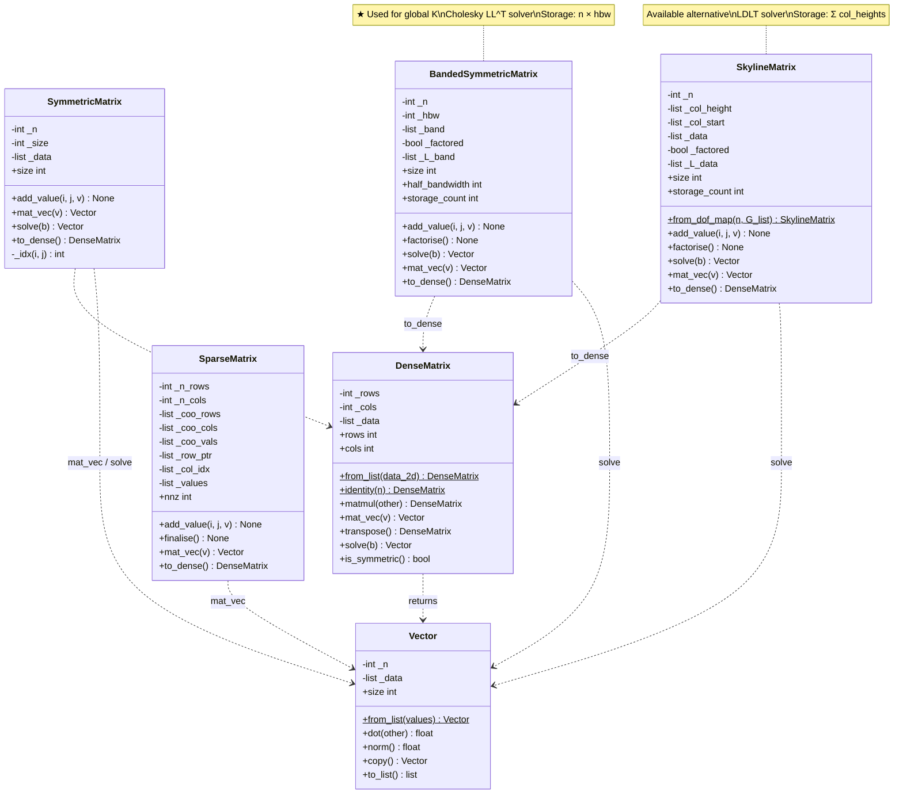
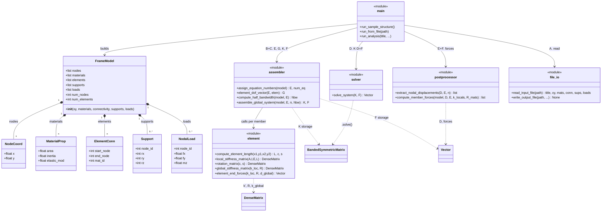
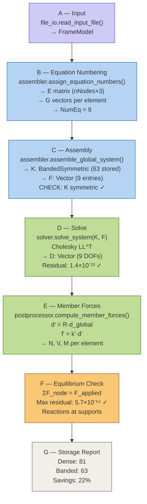

## Diagram 1: Matrix Library Class Hierarchy


## Diagram 2: Frame Analysis Program Structure



## Diagram 3: Analysis Data Flow (Steps A–G)




# 2D Frame Analysis with Custom Matrix Library

This submission contains:

- **Q1:** an object-oriented custom matrix library written without NumPy
- **Q2:** a modular 2D frame analysis program that uses the custom matrix library for all matrix operations and the linear solve

## Main features

- Dense, symmetric, banded symmetric, sparse, and skyline matrix classes
- Banded Cholesky solver for symmetric positive-definite systems
- Course-style direct stiffness workflow using:
  - equation numbering matrix **E**
  - element address vector **G**
  - reduced-system assembly
- Plain-text input file format
- Verification using the 4-node portal frame from the course PDF

## Folder contents

- `matrix_library/` — custom matrix and vector classes
- `frame_analysis/` — structural analysis modules
- `sample_input.txt` — portal-frame verification problem
- `full_output.txt` — full sample output
- `output_results.txt` — sample output file
- `uml_diagrams.html` — UML diagrams for the matrix library and analysis flow
- `tests/` — small verification tests added for submission quality

## How to run

Run the built-in sample:

```bash
python -m frame_analysis.main
```

Run from the provided text file:

```bash
python -m frame_analysis.main sample_input.txt
```

Run from a file and also write results to disk:

```bash
python -m frame_analysis.main sample_input.txt output_results.txt
```

Run the verification tests:

```bash
python -m unittest discover -s tests -v
```

## Input format

Sections are keyword-based and case-insensitive:

- `TITLE`
- `NODES <count>`
- `MATERIALS <count>`
- `ELEMENTS <count>`
- `SUPPORTS <count>`
- `LOADS <count>`

The parser accepts explicit IDs and normalises them internally. `SUPPORTS` and `LOADS` may be written either with or without a separate record ID.

## Homework alignment notes

- **No NumPy or similar library** is used in the matrix library.
- The program uses **symmetry** and a **banded symmetric storage / Cholesky solution scheme**.
- Source files are modular, and public subroutines include docstrings describing purpose, inputs, outputs, assumptions, and units.
- The portal-frame verification reproduces the expected `E`, `G`, `K`, `F`, and `D` results from the course reference problem.
